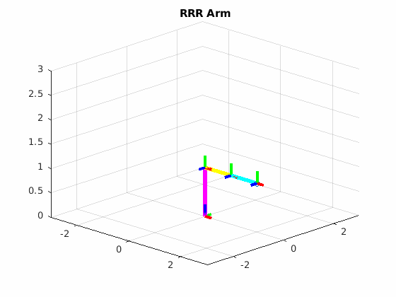
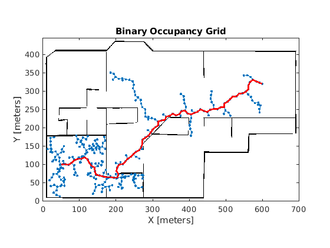
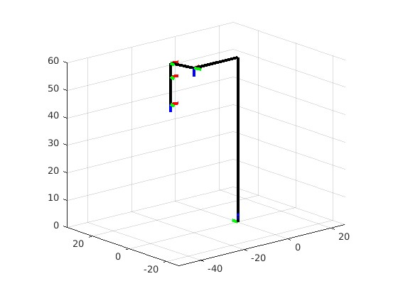
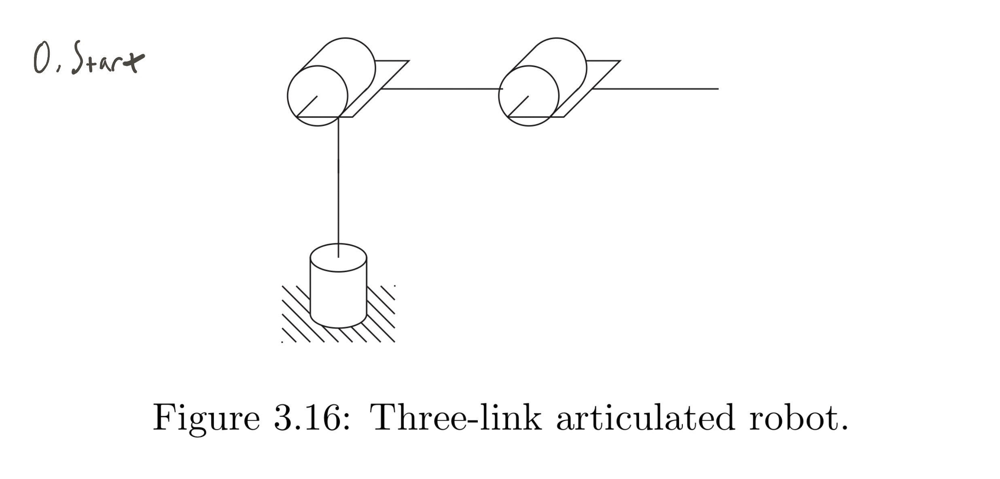
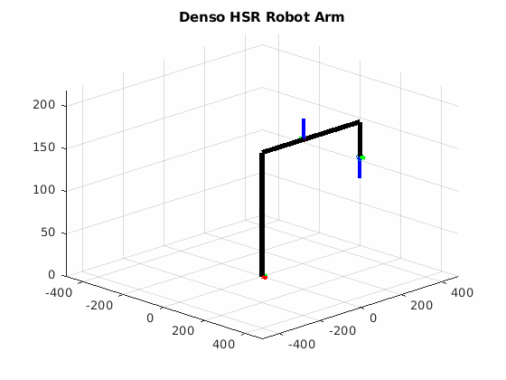
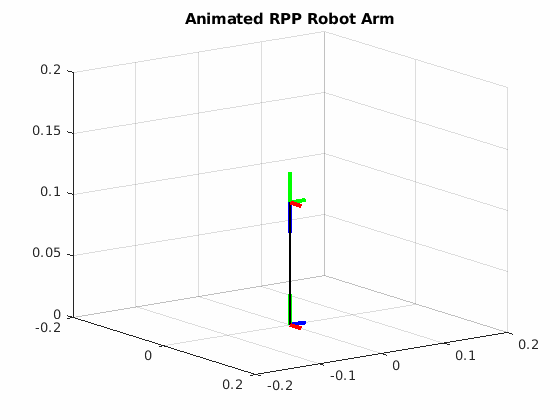

# RBE 500

This is the code repository for my assignments and work within the WPI graduate course of RBE 500 - Foundation of Robotics. The course primarily focused on kinematics with a significant focus on robotic arms. These assignments were mandated to be done as MATLAB LiveScripts (`mlx`) and written as academic papers. Since the `mlx` format is binary and not easy readable, I have PDF exports of each assignment (though it lacks the interactive and animated elements as a result). I tried to capture some GIFs of the work in action as well.

All visualizations were hand coded, though the [gif](https://www.mathworks.com/matlabcentral/fileexchange/63239-gif) function was utilized to create the gif outputs.

## Assignment 1

Assignment 1 was merely an introduction to MATLAB and a warm-up assignment.

## Assignment 2

Assignment 2 was an introduction to rotation and transformation frames utilizing a Denso HSR arm (a popular pick and place RRR arm).

## Assignment 3

A deeper dive into transforms and frames, as well as an exploration of applying it to various robotic arm designs.

## Assignment 4

In this assignment we explore utilizing the DH Table convention to design the transform matricies for working with real robotic arms.

## Assignment 5

Assignment 5 introduced inverse kinematics - we explored first trigonmetry to manually create functions to determine a robot's position, and explore the effects of singularities on these methods.

## Assignment 6

In this assignment we explored calculating joint velocities utilizing the Jacobian.

## Assignmeny 7

We utilize the Mechademic 6 axis robotic arm to further explore the Jacobian and utilize it to identify the nature, identification, and effects of singularities on robotic arms.

## Assignment 9

In assignment 9 we explored configuration and task space, collision detection, and created an *interacive demonstrations* for creating obstacles for a 2 link robotic arm (RR) and demonstrated collision detection and calculating the result collision, task spaces for a given work envelope.

## Assignment 10

In our final assignment, we explored the basics of path finding and explored RRT for a given floorplan.

